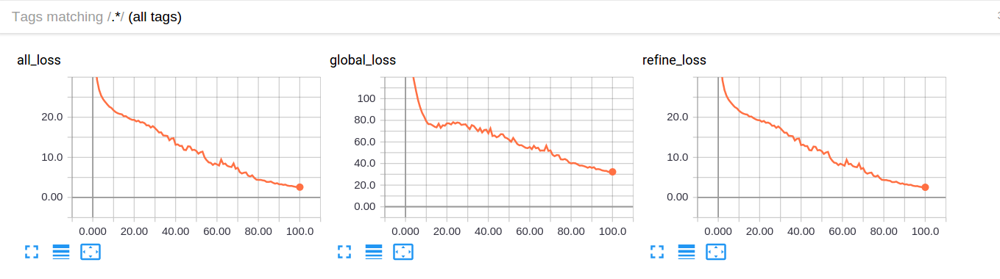
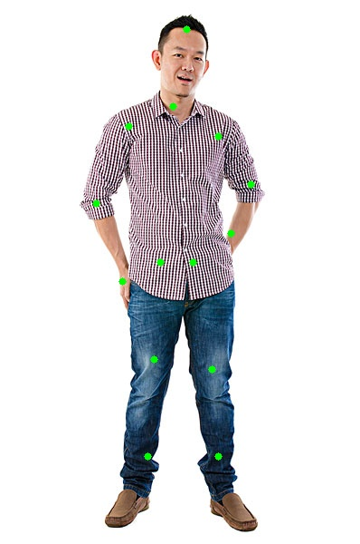
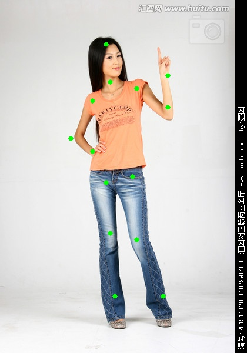

## Cascade Pyramid Network (CPN) on LSP
This is my implementation of CPN on LSP. This implemetation is simple and computation is small (about 3.5G gpu). You can use this implementation for your first 2d-pose estimation project.

### Requirements
PyTorch (0.4 or later)  
opencv-python
tensorboardX
numpy

### Start train
1. download resnet-50.pth from https://download.pytorch.org/models/resnet50-19c8e357.pth
2. download LSP from http://sam.johnson.io/research/lsp_dataset.zip
3. unzip lsp_dataset.zip. There are four parts(joints.mat,images,visualized,readme.txt)
4. set utils/config.py. set pretrained(resnet50.pth), lsp_mat (path of joints.mat) , lsp_images(path of `images` dir) , weights_dir(where the model weights will be saved, not necessary), weights_name(the name of model weights, not necessary), tb_dir(where the tensorboardX will log the performance, not necessary) and other parameters.
5. start train
```
$ python train.py
```
### Look the performance by tensorboardX
```
$ tensorboard --logdir=logs/tblog --port=6006
or
$ tensorboard --logdir=your dir --port=6006
```
Then you can go to http://0.0.0.0:6006 .The results is shown as below:
<div align="center">
  
</div>

### Demo
1. download [cpn_lsp_without_ohkm_best.pth](https://pan.baidu.com/s/1sOY7OH03xdz_UHBstNYyWgs67b) and code is s67b
2.
```
$ python demo.py --img_path vis/test3.jpg --weights_path cpn_lsp_without_ohkm_best.pth --save_path vis/vis3.jpg
```
or use your weights after train.
<div align="center">
    
    
    
</div>

### Acknowledgements  
Thanks [alwc](https://github.com/alwc/fashionAI-keypoints-detection-pytorch) for providing dataloader and model define codes.

### References  
1. [Cascaded Pyramid Network for Multi-Person Pose Estimation](https://arxiv.org/abs/1711.07319)
2. [Clustered Pose and Nonlinear Appearance Models for Human Pose Estimation](http://sam.johnson.io/research/publications/johnson10bmvc.pdf)
3. https://github.com/alwc/fashionAI-keypoints-detection-pytorch